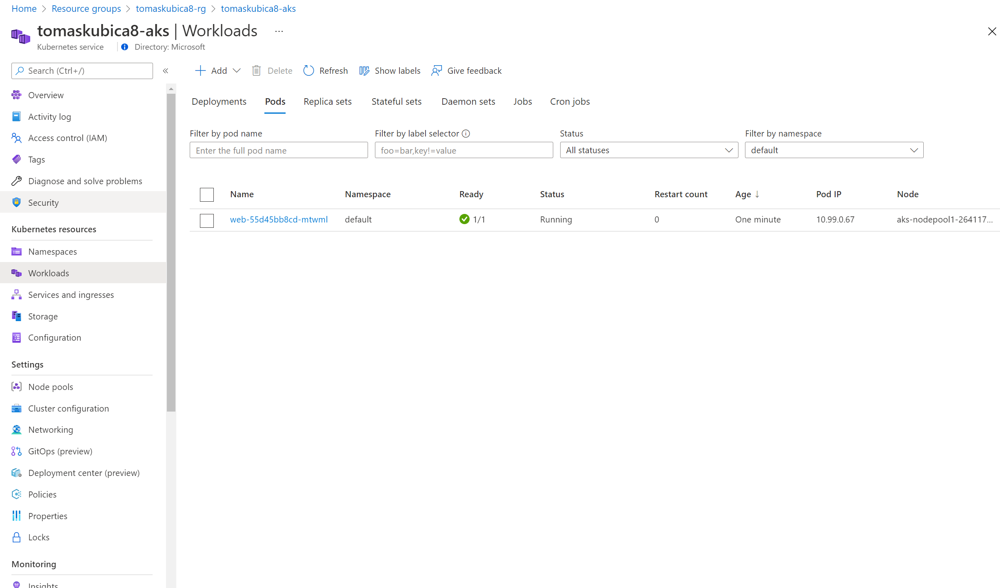

# Deploy Azure Kubernetes Service and first application
In this lab we will create AKS and deploy our web application.

Make sure your prefix is still in defined in your session.

If you use bash:

```bash
export prefix="tomaskubica8"
```

If you use powershell:

```powershell
$prefix="tomaskubica8"
```

Prepare network.

```bash
# Create VNET
az network vnet create -g $prefix-rg -n $prefix-vnet --address-prefixes 10.99.0.0/16
az network vnet subnet create -g $prefix-rg --vnet-name $prefix-vnet -n aks --address-prefix 10.99.0.0/22
az network vnet subnet create -g $prefix-rg --vnet-name $prefix-vnet -n db --address-prefix 10.99.4.0/24
```

```bash
# Create AKS cluster (bash)
az aks create -n $prefix-aks \
    -g $prefix-rg \
    --node-count 2 \
    --node-vm-size Standard_B2ms \
    --zones 1 2 3 \
    --appgw-subnet-cidr 10.99.5.0/24 \
    --attach-acr $prefix \
    --enable-aad \
    --enable-azure-rbac \
    --enable-addons monitoring,ingress-appgw,azure-keyvault-secrets-provider,azure-policy \
    --enable-managed-identity \
    --enable-cluster-autoscaler \
    --enable-defender \
    --enable-oidc-issuer \
    --enable-workload-identity \
    --min-count 2 \
    --max-count 4 \
    --network-policy azure \
    --network-plugin azure \
    --no-ssh-key \
    --vnet-subnet-id $(az network vnet subnet show -g $prefix-rg --vnet-name $prefix-vnet -n aks --query id -o tsv)
```

```powershell
# Create AKS cluster (powershell)
az aks create -n $prefix-aks `
    -g $prefix-rg `
    --node-count 2 `
    --node-vm-size Standard_B2ms `
    --zones 1 2 3 `
    --appgw-subnet-cidr 10.99.5.0/24 `
    --attach-acr $prefix `
    --enable-aad `
    --enable-azure-rbac `
    --enable-addons monitoring,ingress-appgw,azure-keyvault-secrets-provider,azure-policy `
    --enable-cluster-autoscaler `
    --enable-defender `
    --enable-oidc-issuer `
    --enable-workload-identity `
    --min-count 2 `
    --max-count 4 `
    --enable-managed-identity `
    --network-policy azure `
    --network-plugin azure `
    --no-ssh-key `
    --vnet-subnet-id $(az network vnet subnet show -g $prefix-rg --vnet-name $prefix-vnet -n aks --query id -o tsv)
```

Assign RBAC for yourself to AKS, get AKS config file (credentials) and log in - you will be prompted for your AAD login.

```bash
# Make yourself admin of Kubernetes cluster (in bash)
az role assignment create --role "Azure Kubernetes Service RBAC Cluster Admin" \
    --assignee-object-id  $(az ad signed-in-user show --query id -o tsv) \
    --scope $(az aks show -n $prefix-aks -g $prefix-rg --query id -o tsv)

# Make yourself admin of Kubernetes cluster (in powershell)
az role assignment create --role "Azure Kubernetes Service RBAC Cluster Admin" `
    --assignee-object-id  $(az ad signed-in-user show --query objectId -o tsv) `
    --scope $(az aks show -n $prefix-aks -g $prefix-rg --query id -o tsv)

# Get kubeconfig
az aks get-credentials -g $prefix-rg -n $prefix-aks

# Access cluster and get list of nodes
kubectl get nodes
```

We will now deploy web application. Look into file resources/kubernetes/web-deployment.yaml and modify image to fit your container registry. Then deploy application.

```bash
cd resources/kubernetes
kubectl apply -f web-deployment.yaml

# Get pods
kubectl get pods
```

Kubernetes, as per your desired state, deployed one replica of your application. You can also use UI to check details such as k9s, kubelens or native AKS GUI in Azure Portal.



Delete this Pod. Deployment will recognize desired state is 1, but there are 0 running Pods so will create new one for you. You can use Azure portal:


or kubectl (or k9s or kubelens):

```bash
# Delete pod
kubectl delete pod web-55d45bb8cd-mtwml  # replace with your pod name

# Check new one is created
kubectl get pods
```

Our application is now just running Pod - we have not introduced concept to make it accessible from other Pods or even from outside (we will do that in next chapter). Nevertheless, we can use Kubernetes API to make a "bridge" to our computer so we can test application works. Note main URL is not working yet (we miss api, database etc.), but you can use /info to get instance name or /version to get current version of our app.

```bash
# Port-forward Pod to local machine
kubectl port-forward web-bd6c684fc-2dbkj 12345:80

# Access application from different window
curl http://localhost:12345/info
```

# Optional challenge - give read-only access to your colleague
Select one of your colleagues that currently has no access to your cluster and use RBAC to giv him/her read-only access to your cluster to see running pods and nodes.

[https://learn.microsoft.com/en-us/azure/aks/manage-azure-rbac#create-role-assignments-for-users-to-access-cluster](https://learn.microsoft.com/en-us/azure/aks/manage-azure-rbac#create-role-assignments-for-users-to-access-cluster)